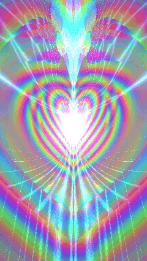
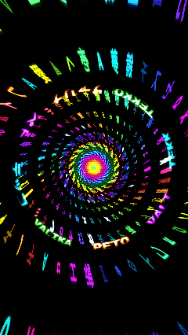
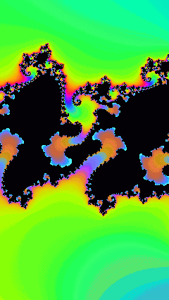
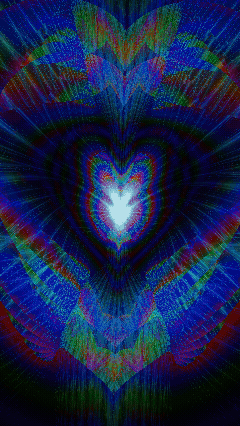
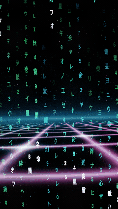
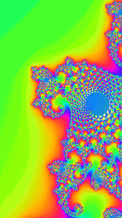
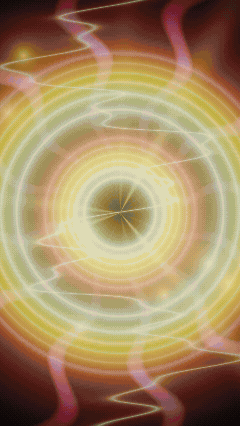

# 💖 Infinite Real-Time GPU Fractals

Continuous scale-invariant GPU fractals in WebAssembly and WebGL2 with vivid psychedelic palettes, zero precision degradation, multi-act demoscene cinematics, and non-repeating soundtrack synchronization.

🌐 **Live Demo Portal**: [https://tekk.github.io/valinfinite/](https://tekk.github.io/valinfinite/)

---

## 🌌 Gallery of 8 Real-Time GPU Fractals

### Series I: Classic GPU Fractals
Continuous logarithmic zooms and pure procedural coordinate topologies.

1. **Celestial Heart**: [https://tekk.github.io/valinfinite/celestial-heart/](https://tekk.github.io/valinfinite/celestial-heart/)
2. **Cyber Matrix Vortex**: [https://tekk.github.io/valinfinite/matrix-vortex/](https://tekk.github.io/valinfinite/matrix-vortex/)
3. **Cosmic Mandelbrot**: [https://tekk.github.io/valinfinite/cosmic-mandelbrot/](https://tekk.github.io/valinfinite/cosmic-mandelbrot/)
4. **Vortex Void**: [https://tekk.github.io/valinfinite/vortex-void/](https://tekk.github.io/valinfinite/vortex-void/)

### Series II: Evolving Narrative & Metamorphic Odysseys
Multi-act narrative journeys, organic Bezier SDF morphing, optical wavefront crossings, and exponential relativistic dynamics.

5. **Celestial Odyssey**: [https://tekk.github.io/valinfinite/celestial-odyssey/](https://tekk.github.io/valinfinite/celestial-odyssey/)
6. **Matrix Saga**: [https://tekk.github.io/valinfinite/matrix-saga/](https://tekk.github.io/valinfinite/matrix-saga/)
7. **Cosmic Infinity**: [https://tekk.github.io/valinfinite/cosmic-infinity/](https://tekk.github.io/valinfinite/cosmic-infinity/)
8. **Vortex Metamorphosis**: [https://tekk.github.io/valinfinite/vortex-metamorphosis/](https://tekk.github.io/valinfinite/vortex-metamorphosis/)

---

## 🔬 Mathematical Formulations & Scene Algorithms

### 1. Celestial Heart (Classic Shepard Scale Zoom)

<div align="center">
  
</div>

#### Logarithmic Octave Synthesis
Scale invariance is achieved using $N = 4$ overlapping octaves with scale multiplier $S = 3.2$. Each octave $k \in \{0, \dots, N-1\}$ has a sawtooth phase $\phi_k(t) \in [0, 1)$:

$$\phi_k(t) = \mathrm{fract}\left(t \cdot v + \frac{k}{N}\right), \quad s_k(t) = \exp\left(\phi_k(t) \cdot \ln S\right)$$

#### Perceptual Octave Windowing
Smooth birth and death of layers are governed by a raised-cosine Hann window:

$$w_k(t) = \frac{1}{2} - \frac{1}{2} \cos\left(2\pi \cdot \phi_k(t)\right)$$

#### Bilateral Symmetry & Cardioid Cleft Fold
Within each octave, the complex coordinate $z$ undergoes bilateral folding and cardioid indentation:

$$z_x \leftarrow |z_x|, \quad z_y \leftarrow z_y - \alpha \left(\sqrt{|z_x| + \epsilon} - \beta\right)$$

---

### 2. Cyber Matrix Vortex (Classic Cylindrical Wormhole)

<div align="center">
  
</div>

#### Cylindrical Raymarched Tunnel Projection
2D screen coordinates $\mathbf{u} = (u_x, u_y)$ map onto an infinite 3D cylinder interior:

$$r = \|\mathbf{u}\|_2, \quad \phi = \mathrm{atan2}(u_y, u_x), \quad z = \frac{1}{r + \epsilon}$$

#### Logarithmic Streaming Cipher Columns
Glyph streams cascade down along cylindrical coordinate boundaries:

$$I(p) = \exp(-\gamma \cdot |p - 1.0|) + \alpha_{\text{ambient}}, \quad p = \mathrm{mod}(\text{row} + t \cdot v_{\text{stream}}, L)$$

#### Mipmapped Stroke & Atmospheric Fog
Glyph stroke intensities and glowing halos are sampled with continuous level-of-detail:

$$I_{\text{glow}}(\mathbf{uv}) = \mathrm{tex}_{\mathrm{LOD}}(\mathbf{uv}, \lambda + 2.5), \quad \mathbf{C}_{\text{pixel}} = \mathbf{C}_{\text{glyph}} \cdot \mathrm{smoothstep}(z_{\max}, z_{\min}, z)$$

---

### 3. Cosmic Mandelbrot (Classic Deep Logarithmic Zoom)

<div align="center">
  
</div>

#### Renormalized Continuous Potential (Escape-Time)
For the complex quadratic map $z_{n+1} = z_n^2 + c$, escape dynamics with threshold $R_{\text{esc}} = 256.0$ eliminate banding artifacts via fractional iteration count:

$$\nu = n + 1 - \frac{\ln(\ln |z_n|)}{\ln 2}$$

#### Cosine Spectrum Palette
Continuous potential maps into a cyclic RGB spectrum:

$$\mathbf{C}(\nu) = \mathbf{a} + \mathbf{b} \cos(2\pi(\mathbf{c} \cdot \nu + \mathbf{d}))$$

#### Smooth Camera Deceleration
Quadratic deceleration dampens the inward velocity as the viewport approaches the deep Seahorse Valley structure:

$$s(t) = \exp\left(\left(t \cdot v_0 - \frac{a}{2} t^2\right) \cdot \ln S\right)$$

---

### 4. Vortex Void (Classic Cardiac Singularity Plunge)

<div align="center">
  
</div>

#### High-Contrast Cardiac Orbit Traps
Complex coordinates are iteratively folded around an asymmetrical cardioid cusp:

$$z_x \leftarrow |z_x|, \quad z_y \leftarrow z_y - 0.52 \left(\sqrt{|z_x| + 0.035} - 0.187\right)$$

$$\mathcal{A} = \sum_{k=1}^M \left(\exp(-3.5 \cdot d_{\text{heart}}(z_k)) + 0.45 \cdot \exp(-7.0 \cdot |z_{k,x} z_{k,y}|)\right)$$

#### Obsidian Contrast Transfer Function
Sigmoid S-curve mapping ensures rich obsidian shadows alongside piercing neon laser highlights:

$$\mathbf{C}_{\text{out}} = \frac{\mathbf{C}_{\text{in}}^{1.6}}{\mathbf{C}_{\text{in}}^{1.6} + 0.16} \cdot 1.30$$

---

### 5. Celestial Odyssey (3-Act Narrative Journey & Wavefront Crossing)

<div align="center">
  
</div>

#### Macro Story Architecture & Dynamic Act Weights
The animation unfolds across a $72.0\text{s}$ macro cycle smoothly partitioned into three distinct acts:

$$w_1(t) + w_2(t) + w_3(t) = 1, \quad \theta_{\text{cam}}(t) = \theta_1(t) w_1(t) + \theta_2(t) w_2(t) + \theta_3(t) w_3(t)$$

- **Act 1: Celestial Genesis ($0\text{s} - 20\text{s}$)**: Serene infinite Shepard scale zoom with gentle breathing sway, sapphire/rose neon auroras, and rhythmic heartbeat pulses.
- **Act 2: Vortex Mandala Bloom ($24\text{s} - 44\text{s}$)**: Hypnotic swirling vortex rotation with dihedral symmetry folds, blooming kaleidoscopic heart rosettes, and emerald-cyan auroras.
- **Act 3: Supernova Astral Storm ($48\text{s} - 68\text{s}$)**: Relativistic accelerating surges, molten plasma gold, incandescent solar core eruptions, and crackling procedural lightning arcs.

#### Scene Changing Crossings (Optical Caustics & Singularity Ripples)
Acts are bridged by optical wavefront sweeps refracting spacetime:

$$\mathbf{u}' = \mathbf{u} + \mathbf{d}_{\text{wave}} \cdot \sin(\psi(\mathbf{u}) \cdot \omega_c) e^{-k_c |\psi(\mathbf{u}) - c_0(t)|}, \quad \mathbf{C}_{\text{crossing}} = \mathbf{C}_{\text{beam}} e^{-k_b |\psi(\mathbf{u}) - c_0(t)|}$$

#### Integrated Strictly Monotonic Zoom Phase
Zoom phase is guaranteed monotonic $\frac{d\Phi}{dt} > 0$ across all time variations:

$$\Phi(t) = v_0 \cdot t - \frac{A_1}{\omega_1} \cos(\omega_1 t) - \frac{A_2}{\omega_2} \cos(\omega_2 t)$$

---

### 6. Matrix Saga (3-Stage Cyberpunk Infiltration & Sacred AI Mandala)

<div align="center">
  
</div>

#### Tri-Realm Convex Interpolation
The narrative progresses through three distinct cyberpunk environments across a $72.0\text{s}$ macro cycle:

$$\mathbf{C}_{\text{total}} = \sum_{k=1}^3 w_k(t) \mathbf{C}_k + \mathbf{C}_{\text{crossing}}, \quad \sum_{k=1}^3 w_k(t) = 1$$

- **Chapter 1: Gateway to Cyberspace ($0\text{s} - 20\text{s}$)**: Planar 3D perspective cyber grid receding into an infinite neon horizon with vertical data cascades.
- **Chapter 2: Helical Vortex Descent ($24\text{s} - 46\text{s}$)**: Accelerated 3D cylindrical vortex plunge with dynamic helical twisting and cipher streams.
- **Chapter 3: Sacred AI Mandala ($50\text{s} - 68\text{s}$)**: Concentric counter-rotating sacred glyph rings orbiting around a blinding incandescent solar singularity with volumetric crepuscular rays.

#### Planar Perspective Grid & Orbital Mandala Equations
- **Perspective Data Grid**:
  $$z_{\text{grid}} = \frac{h}{|u_y + \delta|}, \quad X = u_x \cdot z_{\text{grid}}, \quad Z = z_{\text{grid}} + v_z t, \quad I_{\text{grid}} = e^{-\kappa |X - \lfloor X \rceil|} + e^{-\kappa |Z - \lfloor Z \rceil|}$$
- **Sacred Orbital Rings**:
  $$\theta_k = \phi - \Omega_k t, \quad u_k = \left(\frac{\theta_k}{2\pi} + \frac{1}{2}\right) N_k, \quad I_{\text{ring}}(r) = \exp\left(-\frac{(r - R_k)^2}{2\sigma_k^2}\right)$$

---

### 7. Cosmic Infinity (64,000x Ultra-Zoom & Relativistic Return)

<div align="center">
  
</div>

#### Dual-Phase Zoom Dynamics: Gradual Stop & Exponential Ease-Out Return
The trajectory alternates between an immersive $24.0\text{s}$ plunge deep into Seahorse Valley ($1\times \to 64{,}000\times$) at $c_0 = -0.743643887 + 0.131825904i$, smoothly decelerating to a total standstill, followed by an $8.0\text{s}$ exponential acceleration zoom-out with an easing stop:

$$\text{Zoom-In } (p \in [0, 1]): \quad s_{\text{in}}(p) = \begin{cases} v_0 \cdot p & p \le p_0 \\ 1 - a_{\text{dec}} (1 - p)^2 & p > p_0 \end{cases}, \quad \text{zoom}(p) = \exp(s_{\text{in}}(p) \cdot \ln s_{\max})$$

At $p = 1.0$, the inward velocity $\left.\frac{ds_{\text{in}}}{dp}\right|_{p=1} = 0$, bringing the zoom to a complete standstill at $64{,}000\times$. Zoom-out immediately commences, accelerating exponentially:

$$\text{Zoom-Out } (q \in [0, 1]): \quad g(q) = \frac{\sigma(k(2q - 1)) - \sigma(-k)}{\sigma(k) - \sigma(-k)}, \quad \text{zoom}(q) = \exp((1 - g(q)) \cdot \ln s_{\max})$$

$$\sigma(x) = \frac{1}{1 + \exp(-x)}, \quad \theta_{\text{out}}(q) = \theta_0 + g(q) \cdot (2\pi - \theta_0)$$

---

### 8. Vortex Metamorphosis (8-Phase Bezier Morphing & Procedural VFX)

<div align="center">
  
</div>

Concentric multi-layer Bezier SDF rendering with harmonic scaling and out-of-phase rotational offsets:

$$\mathbf{p}_l = \frac{1}{s_l} \mathbf{R}(\theta_l) \mathbf{p}, \quad s_l = 1 + \alpha l + \delta \sin(\omega_s t + l), \quad d_l = f_{\text{morph}}(\mathbf{p}_l, \max(0, t_{\text{scene}} - l \Delta \tau)) \cdot s_l$$

Continuous topological metamorphosis interpolates between signed distance fields across the sequence:

$$d_{\text{morph}}(t) = (1 - S(\tau)) d_{\text{prev}} + S(\tau) d_{\text{next}}, \quad S(\tau) = \tau^2(3 - 2\tau), \quad \tau = \mathrm{clamp}\left(\frac{t - t_0}{\Delta t}, 0, 1\right)$$

$$\mathbf{C}_{\text{accum}} = \mathbf{C}_{\text{bg}} + \sum_{l=0}^{N-1} w_l \left[ \mathbf{C}_l \left(e^{-k_{\text{core}} |d_l|} + e^{-k_{\text{aura}} |d_l|} + I_{\text{fill}}(d_l)\right) + \mathbf{C}_{\text{hi}} e^{-3 k_{\text{core}} |d_l|} \right]$$

Refractive shockwave solar lensing and ACES filmic tonemapping:

$$\mathbf{p}' = \mathbf{p} + \frac{\mathbf{p}}{\|\mathbf{p}\|} \sin((\|\mathbf{p}\| - r_w) \omega_w) e^{-k_w |\|\mathbf{p}\| - r_w|} \cdot A_w, \quad \mathbf{C}_{\text{final}} = \frac{\mathbf{C} (a \mathbf{C} + b)}{\mathbf{C} (c \mathbf{C} + d) + e}$$

---

## 🎵 Complete 38-Track Demoscene Soundtrack

The audio engine features a persistent non-repeating shuffle pool stored in `localStorage`. Tracks are selected randomly without repetition until the entire library is exhausted, smoothly auto-advancing to provide an unbroken audio-visual journey across sessions:

1. **Fire In My Soul** — Oliver Heldens feat. Shungudzo *(02:55)*
2. **No Limits (Vocal Mix)** — Danism, Train & DJ Rae *(06:15)*
3. **Say My Name (Sub Focus Remix)** — Morgan Seatree, Sub Focus *(03:13)*
4. **Bambou (Original Mix)** — Sebastien Leger *(07:16)*
5. **TRONCE** — Sili *(04:51)*
6. **Beautiful** — Brookes Brothers feat. Robert Owens *(04:55)*
7. **Escapism (Original Mix)** — cYsmix *(05:00)*
8. **Unity** — TheFatRat *(04:09)*
9. **Underground** — Tantrum Desire *(04:34)*
10. **Rhyme Dust (Dimension Remix)** — MK, Dom Dolla *(03:24)*
11. **Horizon** — 1991, Poppy Baskcomb *(03:00)*
12. **Colours & Lights (Clément Leroux Remix)** — GoldFish & Cat Dealers *(03:22)*
13. **Mend Your Ways** — PSYQUI *(04:27)*
14. **Nights Introlude** — Nightmares On Wax *(04:40)*
15. **Genesis** — Subsonic *(03:43)*
16. **Get To Me** — Culture Shock *(04:05)*
17. **Focused** — Soulfreq *(07:36)*
18. **King Of The Swingers (Gettin' Mad Mix)** — Krushed & Sorted *(06:04)*
19. **Drugs I Like** — nate band *(03:18)*
20. **Remember Me** — High Contrast *(03:55)*
21. **TANGARA** — Etherwood, Hugh Hardie *(03:43)*
22. **Beat Keep Rockin'** — Starjunk 95 *(03:03)*
23. **Spectra Ocean Dream Circuit** — Starjunk 95 *(03:14)*
24. **Groove District** — Starjunk 95 *(03:06)*
25. **Tell You What I Did** — Pola & Bryson, Zitah *(03:29)*
26. **TAKE ME** — D A N N Y *(02:09)*
27. **Mirage** — MPH, Skrillex *(04:52)*
28. **Liberate (Lane 8 Remix)** — Eric Prydz *(05:14)*
29. **Szikra** — Kornél Kovács *(06:41)*
30. **I Run** — YUSSI *(02:04)*
31. **On & On** — Chris Lake, Yael Watchman *(03:15)*
32. **Out For Blood** — QZB *(04:08)*
33. **Don't Stop** — MUZZ *(02:56)*
34. **Tu Cafe (Mash Up)** — Prodigy *(04:02)*
35. **The People (Mehlor Remix)** — Harrie Summers, Joey Rich *(06:27)*
36. **Spacefunk** — Stussko, Kolter *(07:36)*
37. **Bunker** — Culture Shock *(04:41)*
38. **On & On (Kanine Remix)** — Sub Focus, bbyclose, Kanine *(02:55)*

---

## 🏛️ Project Architecture

```
├── index.html                   # Responsive landing portal with 3D fluid metaball shader
├── style.css                    # Glassmorphism styling, crossfade cards & animated loops
├── audio/
│   ├── player.js                # Smart non-repeating shuffle audio player (38 tracks)
│   ├── playlist.json            # Track catalog metadata
│   └── tracks/                  # 38 high-fidelity demoscene tracks
│
├── celestial-heart/             # [01] Classic Shepard scale infinite zoom
├── matrix-vortex/               # [02] Classic cylindrical raymarched matrix tunnel
├── cosmic-mandelbrot/           # [03] Classic deep complex logarithmic zoom
├── vortex-void/                 # [04] Classic high-contrast cardiac singularity plunge
│
├── celestial-odyssey/           # [05] 3-Act narrative journey with optical wavefronts
├── matrix-saga/                 # [06] 3-Stage cyberpunk infiltration & sacred AI mandala
├── cosmic-infinity/             # [07] 64,000x ultra-zoom with relativistic S-curve return
├── vortex-metamorphosis/        # [08] 8-Phase Bezier SDF morphing & procedural VFX
│
├── screenshots/                 # 8 Landscape PNGs + 8 Vertical Mobile Animated GIFs
└── src/                         # Rust & WebGL2 shader source pipeline
```

---

## 🛠️ Local Development

```bash
# Compile WASM
wasm-pack build --target web --release

# Serve locally
python3 -m http.server 8088
```
Navigate to `http://localhost:8088/`.
